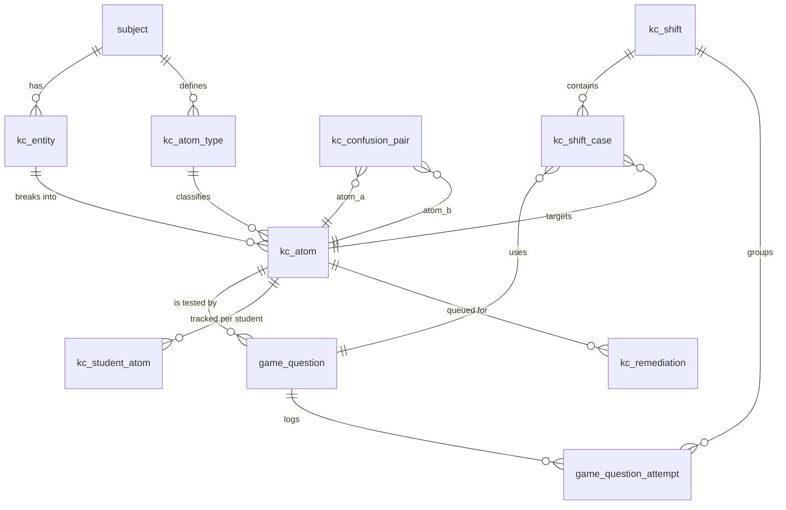

# Knowledge Challenge — database structure

Design for the new **paid knowledge challenge** (gold in → gold out) built on the adaptive
practice engine. This document is the schema/structure proposal only; no tables are created yet.

It **extends the existing MySQL teacher-tools store**
([`server/mysql-game-questions.js`](../server/mysql-game-questions.js)) rather than replacing it,
so teacher authoring, analytics and homework keep working and the press‑`p`
multiple‑choice flow keeps running throughout.

> Content domain is data‑driven. The "input/output devices with 9 atoms" example from the brief
> is **one configuration**, not baked in: atom facets live in a lookup table, so any subject can
> define its own atoms.

---

## 1. How the template maps to storage

| Template concept | Where it lives |
| --- | --- |
| Knowledge atoms (recognition, purpose, comparison, …) | `kc_atom` + `kc_atom_type` |
| 28 devices → 252 atoms | `kc_entity` (28 rows) → `kc_atom` (252 rows) |
| 8 challenge formats | `format` ENUM on `game_question` + `payload_json` |
| Endless scenario generator | `game_question` rows + runtime templating (not stored per case) |
| Confusion pairs (OCR vs OMR) | `kc_confusion_pair` |
| Adaptive selector (35/25/20/15/5) | queries over `kc_student_atom` + `kc_confusion_pair` + `kc_remediation` |
| Fluency stages (Learn→…→Maintain) | `kc_student_atom.stage` (0–5) |
| Wrong‑answer remediation loop | `kc_remediation` + attempt telemetry columns |
| Correction ≠ mastery | `game_question_attempt.first_attempt` / `required_correction` / `recovery_passed` |
| Practice shifts (quick/standard/…/endless) + gold | `kc_shift` + `kc_shift_case` |
| End‑of‑shift report | aggregation over `kc_shift_case` + `kc_student_atom` deltas |

Three layers:

1. **Content** (authored, shared across students): `kc_entity`, `kc_atom_type`, `kc_atom`,
   `kc_confusion_pair`, `game_question` (+ new columns).
2. **Per‑student mastery** (the adaptive brain): `kc_student_atom`, `kc_remediation`,
   `game_question_attempt` (+ new columns).
3. **Session & economy** (the paid game): `kc_shift`, `kc_shift_case`.

---

## 2. Entity relationship overview



Scoping columns (`school_id`, `subject_id`, `teacher_id`, `student_id`, `account_id`) follow the
exact conventions already used by `game_question` / `game_question_attempt`.

---

## 3. Content layer

### 3.1 `kc_entity` — the "device"-level unit

One row per thing that owns multiple atoms (a device, a term, an event, a text…).

```sql
CREATE TABLE IF NOT EXISTS kc_entity (
  id            INT UNSIGNED   NOT NULL AUTO_INCREMENT,
  school_id     INT UNSIGNED   NULL,
  subject_id    INT UNSIGNED   NOT NULL,
  code          VARCHAR(64)    NOT NULL,          -- stable slug, e.g. 'rfid_reader' (never reused)
  name          VARCHAR(120)   NOT NULL,          -- 'RFID reader'
  topic         VARCHAR(96)    NOT NULL DEFAULT '',
  stage         VARCHAR(32)    NOT NULL DEFAULT '',
  summary       TEXT           NOT NULL,          -- canonical handbook entry
  is_active     TINYINT(1)     NOT NULL DEFAULT 1,
  created_at    TIMESTAMP      NOT NULL DEFAULT CURRENT_TIMESTAMP,
  updated_at    TIMESTAMP      NOT NULL DEFAULT CURRENT_TIMESTAMP ON UPDATE CURRENT_TIMESTAMP,
  PRIMARY KEY (id),
  UNIQUE KEY uniq_kc_entity_code (subject_id, code),
  KEY idx_kc_entity_subject (subject_id, is_active),
  KEY idx_kc_entity_topic (topic)
) ENGINE=InnoDB DEFAULT CHARSET=utf8mb4 COLLATE=utf8mb4_unicode_ci;
```

### 3.2 `kc_atom_type` — the facet catalog (data-driven)

The 9 IO facets are just rows here. A different subject can define different facets.

```sql
CREATE TABLE IF NOT EXISTS kc_atom_type (
  id           INT UNSIGNED  NOT NULL AUTO_INCREMENT,
  subject_id   INT UNSIGNED  NULL,              -- NULL = global default set
  code         VARCHAR(48)   NOT NULL,          -- 'recognition','category','purpose','use',
                                                --  'advantage','disadvantage','comparison',
                                                --  'system_role','contextual_justification'
  label        VARCHAR(96)   NOT NULL,
  sort_order   SMALLINT      NOT NULL DEFAULT 0,
  PRIMARY KEY (id),
  UNIQUE KEY uniq_kc_atom_type (subject_id, code)
) ENGINE=InnoDB DEFAULT CHARSET=utf8mb4 COLLATE=utf8mb4_unicode_ci;
```

### 3.3 `kc_atom` — one tracked piece of knowledge

`entity × atom_type` → the 252 atoms in the example (28 × 9).

```sql
CREATE TABLE IF NOT EXISTS kc_atom (
  id            INT UNSIGNED  NOT NULL AUTO_INCREMENT,
  subject_id    INT UNSIGNED  NOT NULL,
  entity_id     INT UNSIGNED  NOT NULL,
  atom_type_id  INT UNSIGNED  NOT NULL,
  code          VARCHAR(96)   NOT NULL,          -- 'rfid_reader.disadvantage'
  statement     TEXT          NOT NULL,          -- the fact this atom represents
  difficulty    TINYINT UNSIGNED NOT NULL DEFAULT 1,  -- 1..3
  is_active     TINYINT(1)    NOT NULL DEFAULT 1,
  created_at    TIMESTAMP     NOT NULL DEFAULT CURRENT_TIMESTAMP,
  PRIMARY KEY (id),
  UNIQUE KEY uniq_kc_atom_code (subject_id, code),
  KEY idx_kc_atom_entity (entity_id),
  KEY idx_kc_atom_type (atom_type_id),
  KEY idx_kc_atom_subject (subject_id, is_active)
) ENGINE=InnoDB DEFAULT CHARSET=utf8mb4 COLLATE=utf8mb4_unicode_ci;
```

### 3.4 `kc_confusion_pair` — commonly confused atoms

Drives the "Discriminate" stage and the selector's 20% confusion budget (OCR vs OMR,
sensor vs actuator, laser vs inkjet).

```sql
CREATE TABLE IF NOT EXISTS kc_confusion_pair (
  id           INT UNSIGNED  NOT NULL AUTO_INCREMENT,
  subject_id   INT UNSIGNED  NOT NULL,
  atom_a_id    INT UNSIGNED  NOT NULL,
  atom_b_id    INT UNSIGNED  NOT NULL,
  note         VARCHAR(240)  NOT NULL DEFAULT '',   -- the decisive distinction
  PRIMARY KEY (id),
  UNIQUE KEY uniq_kc_confusion (subject_id, atom_a_id, atom_b_id),
  KEY idx_kc_confusion_a (atom_a_id),
  KEY idx_kc_confusion_b (atom_b_id)
) ENGINE=InnoDB DEFAULT CHARSET=utf8mb4 COLLATE=utf8mb4_unicode_ci;
```

### 3.5 `game_question` — extended (this is the press-`p` MCQ store)

Today's table already holds `prompt / answers / correct_index / explanation`. We **add** the
atom linkage, the format, and a flexible payload for non‑MCQ formats. Existing rows default to
`format = 'multiple_choice'`, so **press‑`p` keeps working unchanged**.

```sql
ALTER TABLE game_question
  ADD COLUMN format ENUM(
    'multiple_choice',       -- identify / recall — the press-p format
    'classify',              -- input / DDE / output / sensor / actuator …
    'approve_reject',        -- judge a proposed device
    'replace',               -- pick a better component
    'compare',               -- decisive difference between two plausible devices
    'repair_diagram',        -- rebuild sensor → processor → actuator
    'predict_consequence',   -- what breaks if used wrongly
    'construct_justification'-- build characteristic + context + limitation
  ) NOT NULL DEFAULT 'multiple_choice' AFTER spec,
  ADD COLUMN entity_id        INT UNSIGNED NULL AFTER format,
  ADD COLUMN primary_atom_id  INT UNSIGNED NULL AFTER entity_id,
  ADD COLUMN confusion_pair_id INT UNSIGNED NULL AFTER primary_atom_id,
  ADD COLUMN payload_json     LONGTEXT NULL AFTER explanation,  -- format-specific structure
  ADD KEY idx_gq_atom (primary_atom_id),
  ADD KEY idx_gq_format (subject_id, format, is_active),
  ADD KEY idx_gq_confusion (confusion_pair_id);
```

- **`multiple_choice`** keeps using `answers` (JSON array in `LONGTEXT`, as today) + `correct_index`.
- Other formats keep `answers`/`correct_index` where they still make sense and use `payload_json`
  for extra structure. Suggested payloads:
  - `classify` → `{ "options": ["input","direct data entry",…], "correct": 0 }`
  - `compare` → `{ "left_atom_id": 41, "right_atom_id": 77, "decisive": "range vs line of sight" }`
  - `repair_diagram` → `{ "slots": ["sensor","processor","actuator"], "pool": [...], "solution": [...] }`
  - `predict_consequence` → `{ "options": [...], "correct": 2, "consequence": "text shown on wrong pick" }`
  - `construct_justification` → `{ "rubric": ["characteristic","context_link","limitation"], "bank": [...] }`

A many‑to‑many `kc_question_atom` table can be added later if a single challenge must credit
several atoms; the `primary_atom_id` column covers the common case now.

---

## 4. Per-student mastery layer

### 4.1 `kc_student_atom` — the adaptive brain (one row per student × atom)

This is richer than today's per‑*question* `prof.recallMastery`; the engine reasons about
**atoms**, so "recognises OCR but can't justify it" is representable.

```sql
CREATE TABLE IF NOT EXISTS kc_student_atom (
  id                 BIGINT UNSIGNED NOT NULL AUTO_INCREMENT,
  student_id         INT UNSIGNED    NULL,
  account_id         VARCHAR(96)     NOT NULL DEFAULT '',
  subject_id         INT UNSIGNED    NOT NULL,
  atom_id            INT UNSIGNED    NOT NULL,

  stage              TINYINT UNSIGNED NOT NULL DEFAULT 0,   -- 0 learn 1 retrieve 2 discriminate
                                                            -- 3 apply 4 explain 5 maintain
  attempts           INT UNSIGNED    NOT NULL DEFAULT 0,
  correct            INT UNSIGNED    NOT NULL DEFAULT 0,
  first_attempt_correct INT UNSIGNED NOT NULL DEFAULT 0,    -- fluency, not just eventual success
  streak             SMALLINT UNSIGNED NOT NULL DEFAULT 0,
  ease               SMALLINT        NOT NULL DEFAULT 250,   -- ×100, spaced-repetition ease
  interval_idx       TINYINT UNSIGNED NOT NULL DEFAULT 0,    -- into a 6-step interval ladder
  next_due           TIMESTAMP       NULL,                   -- retrieval scheduling

  formats_seen       INT UNSIGNED    NOT NULL DEFAULT 0,     -- bitmask over the 8 formats
  discriminated      TINYINT(1)      NOT NULL DEFAULT 0,     -- passed a close comparison
  near_transfer_ok   TINYINT(1)      NOT NULL DEFAULT 0,     -- solved in a changed context
  explained          TINYINT(1)      NOT NULL DEFAULT 0,     -- constructed a justification
  last_shift_id      BIGINT UNSIGNED NULL,                   -- for the later-session boundary
  sessions_seen      SMALLINT UNSIGNED NOT NULL DEFAULT 0,
  delayed_success    TINYINT(1)      NOT NULL DEFAULT 0,     -- retrieved in a *later* shift

  last_seen_at       TIMESTAMP       NULL,
  updated_at         TIMESTAMP       NOT NULL DEFAULT CURRENT_TIMESTAMP ON UPDATE CURRENT_TIMESTAMP,
  PRIMARY KEY (id),
  UNIQUE KEY uniq_ksa (account_id, atom_id),
  KEY idx_ksa_due (account_id, subject_id, next_due),
  KEY idx_ksa_stage (account_id, subject_id, stage),
  KEY idx_ksa_student (student_id, subject_id)
) ENGINE=InnoDB DEFAULT CHARSET=utf8mb4 COLLATE=utf8mb4_unicode_ci;
```

**Reaching `maintain` (stage 5)** requires evidence, not repetition — the columns encode exactly
the template's gate: `formats_seen` (several formats), `first_attempt_correct` (independent
retrieval), `discriminated`, `near_transfer_ok`, `explained`, and `delayed_success` (a later
session). The stage machine only advances when the relevant flag is set.

### 4.2 `kc_remediation` — the wrong-answer recovery queue

Implements the 4‑step loop: consequence → decisive knowledge → simpler corrective question →
return 3–5 cases later, in a new context/format.

```sql
CREATE TABLE IF NOT EXISTS kc_remediation (
  id             BIGINT UNSIGNED NOT NULL AUTO_INCREMENT,
  account_id     VARCHAR(96)     NOT NULL DEFAULT '',
  student_id     INT UNSIGNED    NULL,
  subject_id     INT UNSIGNED    NOT NULL,
  atom_id        INT UNSIGNED    NOT NULL,
  confusion_pair_id INT UNSIGNED NULL,
  reason         VARCHAR(48)     NOT NULL DEFAULT 'wrong',   -- 'wrong','confusion','regression'
  stage_of_loop  TINYINT UNSIGNED NOT NULL DEFAULT 0,        -- 0 corrective 1 recovery 2 done
  corrective_passed TINYINT(1)   NOT NULL DEFAULT 0,
  recovery_passed   TINYINT(1)   NOT NULL DEFAULT 0,
  due_after_cases SMALLINT UNSIGNED NOT NULL DEFAULT 4,      -- return 3–5 cases later
  status         ENUM('open','done','failed') NOT NULL DEFAULT 'open',
  created_at     TIMESTAMP       NOT NULL DEFAULT CURRENT_TIMESTAMP,
  resolved_at    TIMESTAMP       NULL,
  PRIMARY KEY (id),
  KEY idx_kc_rem_open (account_id, subject_id, status),
  KEY idx_kc_rem_atom (atom_id)
) ENGINE=InnoDB DEFAULT CHARSET=utf8mb4 COLLATE=utf8mb4_unicode_ci;
```

### 4.3 `game_question_attempt` — extended telemetry

The existing per‑answer log already stores `duration_ms`, `source`, `correct`. We **add** the
atom/format/shift linkage and the fluency‑vs‑correction signals the report needs.

```sql
ALTER TABLE game_question_attempt
  ADD COLUMN atom_id          INT UNSIGNED NULL AFTER question_id,
  ADD COLUMN format           VARCHAR(32)  NOT NULL DEFAULT 'multiple_choice' AFTER atom_id,
  ADD COLUMN shift_id         BIGINT UNSIGNED NULL AFTER format,
  ADD COLUMN case_ordinal     SMALLINT UNSIGNED NULL AFTER shift_id,
  ADD COLUMN first_attempt    TINYINT(1) NOT NULL DEFAULT 1,    -- was this the first look?
  ADD COLUMN required_correction TINYINT(1) NOT NULL DEFAULT 0,
  ADD COLUMN corrective_passed   TINYINT(1) NOT NULL DEFAULT 0,
  ADD COLUMN recovery_passed     TINYINT(1) NOT NULL DEFAULT 0,
  ADD COLUMN independent       TINYINT(1) NOT NULL DEFAULT 1,   -- no handbook / no hint
  ADD COLUMN handbook_used     TINYINT(1) NOT NULL DEFAULT 0,
  ADD COLUMN selector_reason   VARCHAR(24) NOT NULL DEFAULT '', -- weakness/retrieval/confusion/…
  ADD KEY idx_gqa_atom (atom_id, created_at),
  ADD KEY idx_gqa_shift (shift_id);
```

> **Correction never erases the first miss.** Reports read `first_attempt` + `correct` for true
> fluency and `required_correction` / `recovery_passed` for recovery — kept separate on purpose.

---

## 5. Session & economy layer (the paid game)

### 5.1 `kc_shift` — a paid run (gold in → gold out)

```sql
CREATE TABLE IF NOT EXISTS kc_shift (
  id                BIGINT UNSIGNED NOT NULL AUTO_INCREMENT,
  account_id        VARCHAR(96)     NOT NULL DEFAULT '',
  student_id        INT UNSIGNED    NULL,
  school_id         INT UNSIGNED    NULL,
  subject_id        INT UNSIGNED    NOT NULL,
  shift_type        ENUM('quick','standard','full','timed','endless') NOT NULL DEFAULT 'standard',
  planned_cases     SMALLINT UNSIGNED NOT NULL DEFAULT 20,   -- 10/20/30/…; 0 = endless
  entry_cost_gold   INT UNSIGNED    NOT NULL DEFAULT 0,      -- debited on start
  payout_gold       INT UNSIGNED    NOT NULL DEFAULT 0,      -- credited on end
  status            ENUM('active','ended','abandoned') NOT NULL DEFAULT 'active',

  completed_cases   SMALLINT UNSIGNED NOT NULL DEFAULT 0,
  first_attempt_correct SMALLINT UNSIGNED NOT NULL DEFAULT 0,
  independent_correct   SMALLINT UNSIGNED NOT NULL DEFAULT 0,
  near_transfer_correct SMALLINT UNSIGNED NOT NULL DEFAULT 0,
  recovery_cases    SMALLINT UNSIGNED NOT NULL DEFAULT 0,
  handbook_uses     SMALLINT UNSIGNED NOT NULL DEFAULT 0,
  best_streak       SMALLINT UNSIGNED NOT NULL DEFAULT 0,
  stages_advanced   SMALLINT UNSIGNED NOT NULL DEFAULT 0,
  avg_response_ms   INT UNSIGNED    NOT NULL DEFAULT 0,

  started_at        TIMESTAMP       NOT NULL DEFAULT CURRENT_TIMESTAMP,
  ended_at          TIMESTAMP       NULL,
  PRIMARY KEY (id),
  KEY idx_kc_shift_acct (account_id, subject_id, started_at),
  KEY idx_kc_shift_status (status)
) ENGINE=InnoDB DEFAULT CHARSET=utf8mb4 COLLATE=utf8mb4_unicode_ci;
```

**Gold flow (server-authoritative, reuses the existing economy):**

1. On start: verify `prof.gold >= entry_cost_gold`, debit it, `recordEconomyGold(client, -cost,
   'knowledge_challenge', 'shift_entry')`, insert `kc_shift(status='active')`.
2. On end: compute `payout_gold` from performance (below), credit `prof.gold`, mark
   `status='ended'`. Abandon/disconnect → `status='abandoned'`, no payout (entry already spent),
   mirroring the blackjack refund-on-disconnect pattern that already exists.

**Default payout formula (configurable):** `payout = round( entry × (baseReturn
+ w_first·firstAttemptRate + w_ind·independentRate + w_near·nearTransferRate + streakBonus) )`,
clamped so a strong run can profit and a weak run loses the stake. Stored as `payout_gold` for
auditability; the coefficients live in `startup-config`, not the schema.

### 5.2 `kc_shift_case` — each case in a shift (feeds the report + payout)

```sql
CREATE TABLE IF NOT EXISTS kc_shift_case (
  id               BIGINT UNSIGNED NOT NULL AUTO_INCREMENT,
  shift_id         BIGINT UNSIGNED NOT NULL,
  ordinal          SMALLINT UNSIGNED NOT NULL,
  question_id      INT UNSIGNED    NOT NULL,
  atom_id          INT UNSIGNED    NOT NULL,
  format           VARCHAR(32)     NOT NULL DEFAULT 'multiple_choice',
  selector_reason  VARCHAR(24)     NOT NULL DEFAULT '',   -- weakness/retrieval/confusion/maintain/near_transfer
  first_attempt_correct TINYINT(1) NOT NULL DEFAULT 0,
  corrected        TINYINT(1)      NOT NULL DEFAULT 0,
  independent      TINYINT(1)      NOT NULL DEFAULT 1,
  response_ms      INT UNSIGNED    NOT NULL DEFAULT 0,
  gold_delta       INT             NOT NULL DEFAULT 0,     -- per-case contribution, if itemised
  created_at       TIMESTAMP       NOT NULL DEFAULT CURRENT_TIMESTAMP,
  PRIMARY KEY (id),
  KEY idx_kc_case_shift (shift_id, ordinal),
  KEY idx_kc_case_atom (atom_id)
) ENGINE=InnoDB DEFAULT CHARSET=utf8mb4 COLLATE=utf8mb4_unicode_ci;
```

---

## 6. Read path — how one press-`p` case is built

1. Player is in a shift (`kc_shift` active) and presses `p`.
2. **Selector** picks the next atom by budget (§7), then picks a `game_question` whose
   `primary_atom_id` matches and whose `format` hasn't been over‑used for that atom
   (`formats_seen`), avoiding the last entity/context.
3. Server sends the challenge (for `multiple_choice`: `prompt` + shuffled `answers`, exactly the
   current flow; for other formats: `payload_json` drives the centre‑of‑screen UI).
4. Answer → write `game_question_attempt` (+ new columns) and a `kc_shift_case`; update
   `kc_student_atom` (stage machine §8); open/advance `kc_remediation` on a miss (§9).

The current `RECALL.selectQuestion` / `reviewQuestion` logic is the seed for the selector and the
stage machine — it moves from per‑question to per‑atom and gains the extra budgets.

---

## 7. Adaptive selector → query mapping

| Budget | Meaning | Query over |
| --- | --- | --- |
| 35% | current weaknesses | `kc_student_atom` where `stage <= 1` or low `first_attempt_correct/attempts` |
| 25% | due for retrieval | `kc_student_atom` where `next_due <= NOW()` |
| 20% | confusion pairs | `kc_confusion_pair` joined to the student's weak/confused atoms |
| 15% | secure maintenance | `kc_student_atom` where `stage >= 4` and `next_due` approaching |
| 5% | hard near‑transfer | high‑`difficulty` atoms in unseen contexts/entities |
| (priority) | open remediation due | `kc_remediation` where `status='open'` and case counter elapsed |

`kc_remediation` is checked **before** the budgets so a scheduled recovery always fires on time.

---

## 8. Fluency stage machine (`kc_student_atom.stage`)

```
0 Learn → 1 Retrieve → 2 Discriminate → 3 Apply → 4 Explain → 5 Maintain
```

Advancement conditions (each also sets the matching flag/column):

| To | Requires |
| --- | --- |
| Retrieve | a `first_attempt_correct` without handbook (`independent`) |
| Discriminate | a correct `compare`/confusion‑pair case → `discriminated = 1` |
| Apply | correct in a *different entity/context* → `near_transfer_ok = 1` |
| Explain | a passed `construct_justification` → `explained = 1` |
| Maintain | `delayed_success = 1` in a **later** `kc_shift` (`last_shift_id` differs) with ≥ N `formats_seen` |

A wrong answer drops the atom (typically to `Retrieve`/`Learn`) and opens remediation; it does not
silently keep the old stage.

---

## 9. Remediation loop (`kc_remediation`)

| Loop step | Storage |
| --- | --- |
| 1. Show consequence | rendered from `game_question.payload_json.consequence` / `explanation` |
| 2. Decisive knowledge | `kc_confusion_pair.note` / atom `statement` |
| 3. Simpler corrective question | pick easier `game_question` on same atom; set `corrective_passed` |
| 4. Return 3–5 cases later | `due_after_cases`; selector re‑injects; set `recovery_passed`, `status` |

`recovery_passed` with `independent = 1` is what the report calls a genuine recovery; failing it
sets `status='failed'` and re‑queues.

---

## 10. Rollout plan

All DDL is **additive** — nothing drops or rewrites existing columns, so it can ship behind a flag
without disturbing the live press‑`p` recall flow.

1. `ensureSchema()` in `mysql-game-questions.js` gains the new `CREATE TABLE`s and the two
   `ALTER TABLE` guards (same `SHOW COLUMNS` pattern already used for homework/curriculum columns).
2. Seed `kc_atom_type` with the 9 default facets (global, `subject_id NULL`).
3. Backfill is optional: existing `game_question` rows work as‑is (`format='multiple_choice'`,
   `primary_atom_id NULL`). Authoring tools attach atoms over time.
4. Per‑student `kc_student_atom` rows are created lazily on first exposure to an atom.
5. `prof.recallMastery` (profile JSON) stays as the **offline / no‑MySQL fallback**; when MySQL is
   present, `kc_student_atom` is the source of truth. (If you later want it to work fully without
   MySQL, that's the "storage‑agnostic" option we did not take here.)

## 11. Decisions (chosen)

- **Economy = mild sink that always rewards real learning.** Starting values (all in
  `startup-config`, tunable without a migration):

  | Shift | Cases | Entry | Max payout |
  | --- | --- | --- | --- |
  | Quick | 10 | 20g | ~34g |
  | Standard | 20 | 40g | ~68g |
  | Full | 30 | 60g | ~102g |
  | Timed | 20 | 40g | ~75g (speed bonus) |
  | Endless | — | 25g | settle‑on‑exit |

  `payout = performance + mastery_bonus`, where
  `performance = entry × (0.5 + 1.2 × (0.6·firstAttemptRate + 0.4·independentRate) + streakBonus)`
  (break‑even ≈ 70% first‑attempt‑independent), and
  `mastery_bonus = 5g × stages_advanced + 15g × atoms_reaching_maintain`. The mastery bonus means
  genuine learning always pays; careless grinding of known atoms slowly bleeds gold, so it never
  behaves like gambling.

- **Endless shift = settle‑on‑exit with cash‑out checkpoints** (bank every 5 cases; leaving
  mid‑segment keeps the last banked amount). Avoids per‑case grind‑farming.

- **Single `primary_atom_id` for now; no `kc_question_atom` join table.** One challenge credits one
  atom in nearly every case. Add the join only when authored challenges must credit several atoms.

- **MCQ‑only authoring first.** Teachers keep the existing `multiple_choice` authoring UI; the
  entity/atom graph and the other 7 formats are loaded via a content‑import script for a pilot
  subject. A full atom + 8‑format authoring UI comes after the loop is proven.

- **Keep extending `game_question`; do not rename to `kc_challenge` yet.** Only worth it once
  non‑MCQ formats dominate, and it would destabilise press‑`p` for no present gain.

### Build order

1. ✅ **`ensureSchema()` migration + seed the 9 atom types** — additive, zero behaviour change.
   Implemented in [`server/mysql-game-questions.js`](../server/mysql-game-questions.js)
   (`ensureKnowledgeChallengeSchema` / `ensureKnowledgeChallengeColumns` /
   `seedKnowledgeChallengeAtomTypes`).
2. ✅ **Atom‑aware selector + fluency engine** — pure, storage‑free module
   [`shared/knowledge-challenge.js`](../shared/knowledge-challenge.js): `reviewAtom` (the 6‑stage
   machine + spaced scheduling, with "correction ≠ mastery"), `selectNextAtom` (the 35/25/20/15/5
   budget with remediation priority), `masteryOverview`. Unit‑tested in
   [`server/test/knowledge-challenge.test.js`](../server/test/knowledge-challenge.test.js).
3. ✅ **Store persistence methods** on `MySqlGameQuestionStore`
   ([`server/mysql-game-questions.js`](../server/mysql-game-questions.js)): `loadStudentAtoms`
   (selector input), `recordAtomReview` (load → run the engine → upsert `kc_student_atom`),
   `loadConfusionPairs`, `listOpenRemediation` / `openRemediation` / `resolveRemediation`,
   `startShift` / `recordShiftCase` / `endShift`, `logChallengeAttempt` (extended
   `game_question_attempt`), and `resolvePlaySubject`. Player state keys on `account_id` so it
   works for any account. Unit‑tested in
   [`server/test/knowledge-challenge-store.test.js`](../server/test/knowledge-challenge-store.test.js).
4. ✅ **Shift lifecycle + gold in/out** — server mixin
   [`server/rooms/knowledge-challenge.mixin.js`](../server/rooms/knowledge-challenge.mixin.js)
   (`kcStart` / `kcAnswer` / `kcEnd` messages, wired in
   [`GameRoom.js`](../server/rooms/GameRoom.js)): debits the entry stake via `recordEconomyGold`,
   runs the selector + `loadChallengeForAtom` per case, grades and persists each case, and on end
   computes the payout (`KC.computeShiftPayout`, entry/coefficients in the mixin's `KC_CONFIG`) and
   credits gold. Disconnect forfeits an active shift (stake already spent). Tested in
   [`server/test/knowledge-challenge-room.test.js`](../server/test/knowledge-challenge-room.test.js)
   and the payout math in `knowledge-challenge.test.js`.
5. ✅ **Content import + client** —
   - Import: `MySqlGameQuestionStore.importContentPack` (idempotent entities → atoms → atom-linked
     questions → confusion pairs), CLI [`tools/seed-knowledge-challenge.js`], sample pack
     [`content/knowledge-challenge/sample-pack.json`].
   - Client: controller/overlay [`client/js/knowledge-challenge.mjs`] (chooser → cases → per-case
     feedback → end-of-shift report), relayed by `networking.mjs`, launched from a **Knowledge
     Challenge** button in the tavern (`menus.mjs` `openTavernUI`). Static wiring test in
     `client-modules.test.js`; render paths verified in-browser.

6. ✅ **Remediation return-loop (in-shift).** A miss opens a durable `kc_remediation` row and
   schedules the atom to return **3–5 cases later** as a flagged recovery
   (`shift.remediation` + `kcServeNextCase` feeds due items to the selector). Passing the recovery
   closes it (`resolveRemediation` with `recoveryPassed`, `totals.recoveryCases++`); failing it
   re-schedules. The attempt log records `first_attempt`/`required_correction`/`recovery_passed`
   accordingly. Tested in `knowledge-challenge-room.test.js`.

7. ✅ **Inline corrective (in-shift, immediate).** On a miss the server sends `kcCorrective`
   (consequence → decisive knowledge → a reduced two-option question — the correct answer plus the
   one the player picked) and **withholds the next case** until the player answers `kcCorrective`.
   Passing/failing is recorded on the same durable `kc_remediation` row (`corrective_passed`, kept
   `open` for the later recovery). Client renders it in `knowledge-challenge.mjs`; verified in
   browser (result → corrective → corrective-result → continue). Server logic tested in
   `knowledge-challenge-room.test.js`.

8. ✅ **All eight challenge formats render.** The five single-choice formats (`classify`,
   `approve_reject`, `replace`, `compare`, `predict_consequence`) ride the index protocol with
   format-specific framing (instruction line, two-up / option-grid layouts). The two assembly
   formats have real interactions + server grading:
   - **`construct_justification`** — multi-select the parts of a complete justification; graded as a
     set (`kcGrade` construct). Payload: `{ prompt, bank: [{ text, correct: bool }, …] }`.
   - **`repair_diagram`** — place pool pieces in order into the flow slots; graded as an ordered
     sequence. Payload: `{ prompt, pool: [string, …], solution: [poolIndex, …] }` (server shuffles
     the pool and remaps the solution).

   `kcBuildCase` shapes the served case + grade; `kcGrade` grades by format. Renderers in
   `knowledge-challenge.mjs` (`renderChoices` / `renderConstruct` / `renderRepair`), tested in
   `knowledge-challenge-room.test.js` and verified in browser. The inline corrective stays MCQ-only
   (assembly misses skip the corrective and use the return-later loop).

   **Still open:** a full end-to-end run needs a MySQL backend with a seeded pilot subject
   (`node tools/seed-knowledge-challenge.js`); the shipped sample pack is `multiple_choice` only —
   author `construct_justification` / `repair_diagram` questions using the payloads above to
   exercise those formats live.
